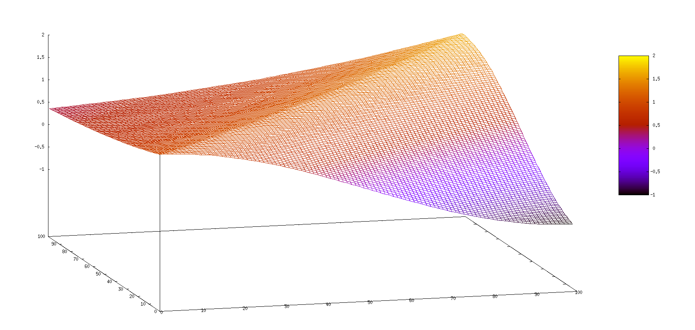

# Transport equation solver

## Install ALL dependencies (100% reproducible, I promise)
```shell
nix develop
```
Install nix if you still don't have it. See https://nixos.org/download/ .

## Compile
```shell
cmake -S . -B build
cmake --build build
```

## Run
```shell
# To measure performance
./scripts/measure.sh <grid-size> <num-of-processes>

# To plot the solution
./scripts/plot.sh <grid-size>

```

## Approximate result
After running:
```shell
./scripts/plot.sh 100
```

